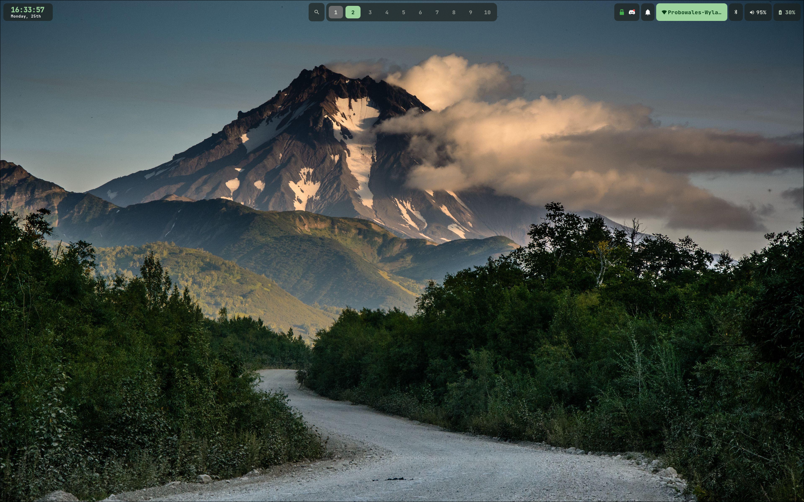
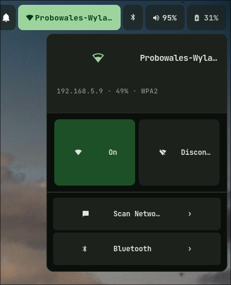
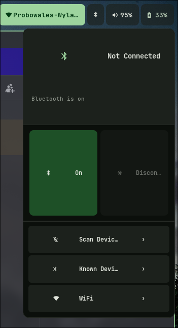
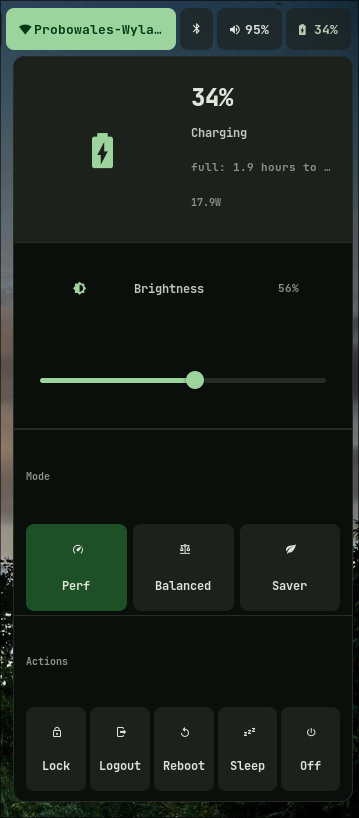
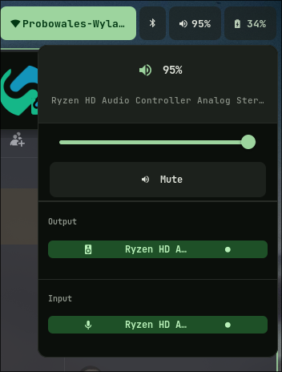

# dotfiles
My Arch Linux dotfiles — Hyprland + Waybar + Matugen theming.

## Stack
- **WM**: Hyprland
- **Bar**: Waybar
- **Theming**: Matugen (material you, wallpaper-driven colors)
- **Terminal**: Kitty
- **Shell**: Zsh + Oh My Zsh
- **Launcher & Menus (battery, network)**: Rofi
- **Notifications**: SwayNC
- **Editor**: Neovim

## Preview



<p align="center">
  
  
  
  
</p>

# CAUTION
My dotfiles include the apps needed to run a desktop and styling, they do not include apps like firefox or visual studio code. My dotfiles are not a development environment

## Latest beta version
> This clones directly from the main branch. For a stable snapshot, install from the [releases page](https://github.com/olvk20/olvk20-dots/releases) instead.
```bash
git clone https://github.com/olvk20/olvk20-dots/ ~/dotfiles
cd ~/dotfiles
chmod +x install.sh
./install.sh
```

The script will:
1. Install all packages from `packages/pacman.txt`
2. Symlink every entry in `config/` to `~/.config/`
3. Symlink home dotfiles (`.zshrc`, etc.)
4. Copy wallpapers to `~/Pictures/Wallpapers`
5. Install Oh My Zsh if missing

## Layout

```
dotfiles/
├── config/       → symlinked to ~/.config/*
├── home/         → symlinked to ~/.*
├── packages/
│   ├── pacman.txt   pacman -Qqe
│   └── aur.txt      AUR packages
└── wallpapers/   → copied to ~/Pictures/Wallpapers
```

## After install

Run `matugen image <wallpaper>` to regenerate colors from your current wallpaper.
